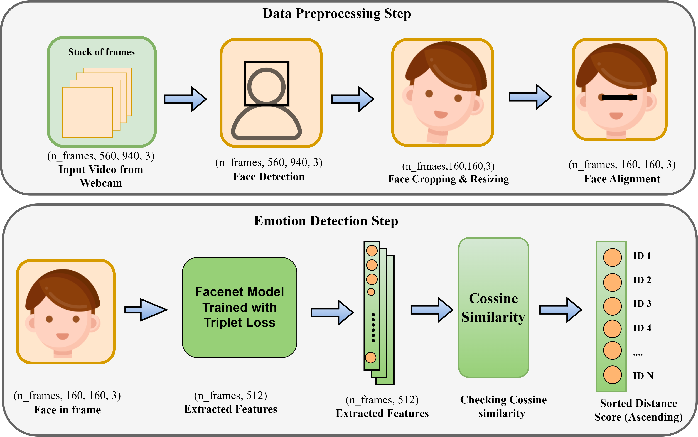
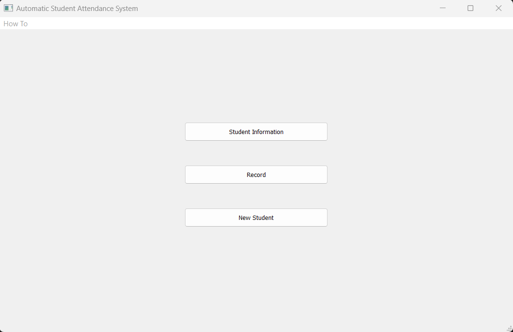

# ***Face Recognition for Student Attendance System Using FaceNet Siamese One shot Learning***

The purpose of this repository is to develop an automatic student attendance system (an application of face recognition). The proposed system is developed usnig FaceNet model. FaceNet offers a single representation that can be used for face recognition, verification, and clustering purposes. It transforms each facial image into a Euclidean space where the distances between points reflect the similarity between faces. In other words, an image of person A will be positioned closer to all other images of person A than to images of any other individuals within the dataset. The FaceNet model is trained  using a Siamese architecture coupled with a triplet loss function. Once the model is trained, we can employ one-shot learning for facial recognition by extracting the facial embedding of any new person. The detailed information about FaceNet can be found in the original paper titled "<a href = https://arxiv.org/abs/1503.03832> FaceNet: A Unified Embedding for Face Recognition and Clustering"</a>. The block diagram of the system is illustrated in the following figure. 

When a student is in front of the laptop webcam, the system captures each frame, identifies faces, and then crops and resizes these faces to extract facial embeddings using the pre-trained FaceNet model. Subsequently, it computes the cosine similarity between these embeddings and the images of other students stored in the database. A very low cosine distance score indicates a match, while a large distance score suggests a mismatch. Finally, the system sorts the distance scores for each student in ascending order, and if the lowest score is below a certain threshold, it returns the corresponding student ID as the matched student.

## Dependencies
python 3.9.18
!pip install mediapipe==0.9.2.1
!pip install opencv-python==4.8.1
!pip install PyQt5==5.15.9
!pip install tensorflow==2.10.1

## Running the system

1. Save The students' name and ID in their respective class at the <b>Students_information</b> directory. The directory structure should be as follows-
   __ Students_information
       |__ class_1            -----------------  (class name)
              |__ 1000        -----------------  (student id)
                   |__ students_information.xlsx
              |__ 1001        -----------------  (student id)
                   |__ students_information.xlsx
                 .
                 .
              |__1010         -----------------  (student id)
                   |__ students_information.xlsx
   
3. In the database directory, establish a folder for each individual student inside their respective class folder with their ID and save one picture each. The directory structure should be -
   __ Database
       |__ class_1                   (class name)
              |__ 1000               (student id)
                   |__ img_name.jpg
              |__ 1001               (student id)
                   |__ img_name.jpg
                 .
                 .
              |__1010                (student id)
                   |__ img_name.jpg

5. Then run the main_gui.py file. It will open a graphical user interface (GUI) with three options (Students Information, Record, New Student).

6. Record option is used to take auto attendance through the webcam using face recognition

7. (Optional) New Student option can also be used to enroll new student in the system.

